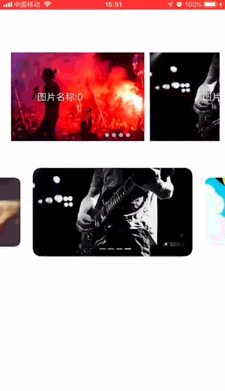
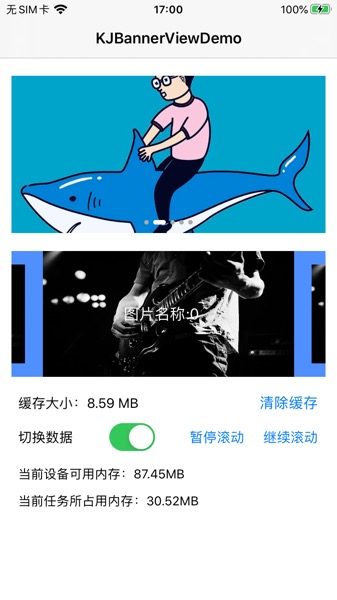

# KJBannerView

<p align="left">


</p>

<!--<p align="left">
  
  
</p>-->

<!--<video id="video" controls="" preload="none" width="375px" height="667px" poster="https://raw.githubusercontent.com/yangKJ/KJBannerViewDemo/master/Res/IMG_6906.PNG">
<source id="mp4" src="Res/IMG_6904.mp4" type="video/mp4">
</video>-->

----------------------------------------
### 框架整体介绍
* [作者信息](#作者信息)
* [作者其他库](#作者其他库)
* [功能介绍](#功能介绍)
* [Pod使用方法](#使用方法(支持cocoapods/carthage安装))
* [更新日志](#更新日志)
* [效果图](#效果图)
* [KJBannerView 功能区](#KJBannerView)
* [打赏作者 &radic;](#打赏作者)

----------------------------------------
#### <a id="功能介绍"></a>功能介绍
KJBannerView 是一款轮播Banner，自带图片下载、缓存相关功能、轻量级组件    
1.无任何第三方依赖、自带缓存加载  ☑️  
2.缩放无限循环滚动  ☑️  
3.自定义继承 KJBannerViewCell、定制特定样式  ☑️  
4.支持网络GIF和网络图片和本地图片混合轮播  ☑️  
5.支持在Storyboard和Xib中创建并配置其属性  ☑️  

----------------------------------------
#### 温馨提示
#####1、使用第三方库Xcode报错  
Cannot synthesize weak property because the current deployment target does not support weak references  
可在`Podfile`文件底下加入下面的代码，'8.0'是对应的部署目标（deployment target） 删除库重新Pod  
不支持用weak修饰属性，而weak在使用ARC管理引用计数项目中才可使用  
遍历每个develop target，将target支持版本统一设成一个支持ARC的版本

```
##################加入代码##################
# 使用第三方库xcode报错Cannot synthesize weak property because the current deployment target does not support weak references
post_install do |installer|
installer.pods_project.targets.each do |target|
target.build_configurations.each do |config|
config.build_settings['IPHONEOS_DEPLOYMENT_TARGET'] = '8.0'
end
end
end
##################加入代码##################
```
#####2、若搜索不到库
- 方案1：可执行pod repo update
- 方案2：使用 rm ~/Library/Caches/CocoaPods/search_index.json 移除本地索引然后再执行安装
- 方案3：更新一下 CocoaPods 版本

----------------------------------------

#### <a id="作者信息"></a>作者信息
> Github地址：https://github.com/yangKJ  
> 简书地址：https://www.jianshu.com/u/c84c00476ab6  
> 博客地址：https://blog.csdn.net/qq_34534179  

#### <a id="作者其他库"></a>作者其他Pod库
```
粒子效果、Button图文混排、点击事件封装、扩大点击域、点赞粒子效果，
手势封装、圆角渐变、倒影、内阴影处理、Xib属性、识别网址超链接，
图片加工处理、对花铺贴效果、滤镜渲染、泛洪算法等等
pod 'KJEmitterView'
pod 'KJEmitterView/Function'#
pod 'KJEmitterView/Control' # 自定义控件

轮播图 - 支持缩放 多种pagecontrol 支持继承自定义样式 自带网络加载和缓存 Xib布局设置属性
pod 'KJBannerView'  # 轮播图，网络图片加载 支持网络GIF和网络图片和本地图片混合轮播

加载Loading - 多种样式供选择 HUD控件封装
pod 'KJLoadingAnimation' # 加载控件

菜单控件 - 下拉控件 选择控件
pod 'KJMenuView' # 菜单控件

播放器 - KJPlayer是一款视频播放器，AVPlayer的封装，继承UIView
- 视频可以边下边播，把播放器播放过的数据流缓存到本地，下次直接从缓冲读取播放
pod 'KJPlayer'  # 播放器功能区
pod 'KJPlayer/KJPlayerView'  # 自带展示界面

工具库 - 推送工具、网络下载工具、识别网页图片工具等
pod 'KJWorkbox' # 系统工具
pod 'KJWorkbox/CommonBox'

```

##### Issue
如果您在使用中有好的需求及建议，或者遇到什么bug，欢迎随时issue，我会及时的回复，有空也会不断优化更新这些库

#### <a id="使用方法(支持cocoapods/carthage安装)"></a>Pod使用方法
```
pod 'KJBannerView' # 轮播图 
```

#### <a id="更新日志"></a>更新日志
```
####版本更新日志:
### 版本1.3.5
- 独立委托协议类KJBannerViewProtocol，归类代码更加简洁
- 新增滚动回调 kScrollBlock
- 细节优化

### 版本1.3.4
- 解决只有一张图片显示异常问题
- 多线程处理gif数据，再次提升效率

### 版本1.3.3
- 优化图片下载速率，解决卡顿问题
- 修改kj_BannerView:BannerViewCell:ImageDatas:Index:委托方法，解决Memory疯涨问题

### 版本1.3.2
- 新增 NSTimer+KJSolve 解决计时器循环引用

### 版本1.3.0
- 新增KJBannerViewDataSource委托，更方便的自定义方式 不需要再继承 KJBannerViewCell
- kj_BannerView:BannerViewCell:ImageDatas:Index: 此方法和 itemClass 互斥
- 新增裁剪网络图片从而提高效率 kj_scale
- Banner支持在Storyboard和Xib中创建并配置其属性

### 版本1.2.6
- KJPageControl 新增大小点类型 PageControlStyleSizeDot
- 优化修改网友提出的卡顿问题
- 移出 KJBannerViewCell 当中的判断处理，从而提高效率

### 版本1.2.5
- 新增委托方法 kj_BannerView:CurrentIndex: 滚动时候回调 可是否隐藏自带的PageControl
- 优化性能，修复重复创建PageControl

### 版本1.2.4
- 新增本地和网络图片混合，自带判断方式，去掉以前的本地判断方式
- 新增Gif图显示，支持本地图片、网络图片、网络GIF图片混合显示
- KJBannerViewImageType 控制图片的显示类型

### 版本1.2.2
- 修改pageControl样式颜色的修改方式，从而提高效率

### 版本1.2.1
- 再次优化，提高性能
- 新增自带Cell显示本地图片 isLocalityImage

### 版本1.2.0
- 新增自定义KJPageControl，支持3种样式（圆形，长方形，正方形）
- 重新整理，从而提高轮播图性能
- 自带Cell新增默认占位图，一条数据时隐藏KJPageControl

### 版本1.1.1
- 新增支持Swift宏
- 新增Block代理点击事件 KJBannerViewBlock
- 新增设置滚动方向属性 rollType

### 版本1.1.0
- 新增 支持自定义Cell
- 使用方法：
- 创建从KJBannerViewCell继承的Cell
- 在model设置数据

- (instancetype)initWithFrame:(CGRect)frame{
    if (self=[super initWithFrame:frame]) {
        [self.contentView addSubview:self.NameLabel];
    }
    return self;
}
- (void)setModel:(NSObject *)model{
    KJBannerModel *kj_model = (KJBannerModel*)model;
    self.NameLabel.text = kj_model.customTitle;
}

### 版本 1.0.2
- 新增 KJBannerView 轮播图 - banner支持缩放
- 自带图片下载、缓存相关功能，无任何第三方依赖、轻量级组件

```

#### <a id="效果图"></a>效果图


#### <a id="KJBannerView"></a>KJBannerView

- KJPageControl：自定义三种PageControl  长方形、正方形、圆形
- KJBannerViewFlowLayout：Cell缩放管理
- KJBannerViewCell：基类Cell，自定义的Cell需继承该Cell
- KJLoadImageView：图片下载工具类
- KJBannerTool：工具方法

##### 代码事例
```
//
//  ViewController.m
//  KJBannerViewDemo
//
//  Created by 杨科军 on 2018/12/22.
//  Copyright © 2018 杨科军. All rights reserved.
//

#import "ViewController.h"
#import "KJBannerHeader.h"
#import "KJCollectionViewCell.h"
#import "KJBannerModel.h"
#import <objc/message.h>
#import "KJTestViewController.h"

#define gif @"https://timgsa.baidu.com/timg?image&quality=80&size=b9999_10000&sec=1564463770360&di=c93e799328198337ed68c61381bcd0be&imgtype=0&src=http%3A%2F%2Fimg.mp.itc.cn%2Fupload%2F20170714%2F1eed483f1874437990ad84c50ecfc82a_th.jpg"

@interface ViewController ()<KJBannerViewDelegate,KJBannerViewDataSource>{
    __block UILabel *lab,*labe;
}
@property (weak, nonatomic) IBOutlet KJBannerView *banner;
@property (weak, nonatomic) IBOutlet UIView *backView;
@property (weak, nonatomic) IBOutlet UILabel *label;
@property (weak, nonatomic) IBOutlet UIButton *button;
@property (weak, nonatomic) IBOutlet UISwitch *Switch;
@property (nonatomic,strong) KJBannerView *banner2;
@property (nonatomic,strong) NSArray *temp;
@end

@implementation ViewController

- (void)viewDidAppear:(BOOL)animated{
    [super viewDidAppear:animated];
    [self.banner kj_repauseTimer];
    [self.banner2 kj_repauseTimer];
}
- (void)viewDidDisappear:(BOOL)animated{
    [super viewDidDisappear:animated];
    [self.banner kj_pauseTimer];
    [self.banner2 kj_pauseTimer];
}

- (void)viewDidLoad {
    [super viewDidLoad];
    
    [self _setDatas];
    [self setXib];
    [self setUI];
    [self setTimer];
}

- (void)setUI{
    KJBannerView *banner2 = [[KJBannerView alloc]initWithFrame:self.backView.bounds];
    self.banner2 = banner2;
    banner2.imgCornerRadius = 15;
    banner2.autoScrollTimeInterval = 2;
    banner2.isZoom = YES;
    banner2.itemSpace = -10;
    banner2.itemWidth = 280;
    banner2.delegate = self;
    banner2.dataSource = self;
//    banner2.itemClass = [KJCollectionViewCell class];
    banner2.imageType = KJBannerViewImageTypeMix;
    [self.backView addSubview:banner2];
    self.banner2.imageDatas = self.temp;
    
    [self.button addTarget:self action:@selector(clearAction) forControlEvents:(UIControlEventTouchUpInside)];
    [self.Switch addTarget:self action:@selector(qiehuanAction:) forControlEvents:(UIControlEventValueChanged)];
    
    long long num = [KJLoadImageView kj_imagesCacheSize];
    self.label.text = [NSString stringWithFormat:@"缓存大小：%.02f MB",num / 1024 / 1024.0];
    
    CGFloat w = self.view.frame.size.width;
    CGFloat h = CGRectGetMaxY(self.label.frame) + 50;
    UILabel *label = [[UILabel alloc]initWithFrame:CGRectMake(20, h + 30, w-40, 20)];
//    label.textColor = UIColor.greenColor;
    label.font = [UIFont systemFontOfSize:14];
    [self.view addSubview:label];
    
    UILabel *label2 = [[UILabel alloc]initWithFrame:CGRectMake(20, h + 30 + 30, w-40, 20)];
//    label2.textColor = UIColor.greenColor;
    label2.font = [UIFont systemFontOfSize:14];
    [self.view addSubview:label2];
    
    lab = label;
    labe = label2;
    label.text = [NSString stringWithFormat:@"当前设备可用内存：%.2fMB",[KJTestViewController availableMemory]];
    label2.text = [NSString stringWithFormat:@"当前任务所占用内存：%.2fMB",[KJTestViewController usedMemory]];
}

- (void)setTimer{
    __weak typeof(self) weakself = self;
    NSTimer*timer = [NSTimer kj_scheduledTimerWithTimeInterval:1.0 Repeats:YES Block:^(NSTimer *timer) {
        dispatch_async(dispatch_get_main_queue(), ^{
            lab.text = [NSString stringWithFormat:@"当前设备可用内存：%.2fMB",[KJTestViewController availableMemory]];
            labe.text =[NSString stringWithFormat:@"当前任务所占用内存：%.2fMB",[KJTestViewController usedMemory]];
            weakself.label.text = [NSString stringWithFormat:@"缓存大小：%.02f MB",[KJLoadImageView kj_imagesCacheSize] / 1024 / 1024.0];
        });
    }];
    [[NSRunLoop mainRunLoop] addTimer:timer forMode:NSRunLoopCommonModes];
}

- (void)setXib{
    /// xib方式
    self.banner.delegate = self;
    self.banner.pageControl.pageType = PageControlStyleSizeDot;
    self.banner.imageType = KJBannerViewImageTypeMix;
    self.banner.imageDatas = @[gif,@"98338_https_hhh",@"tu3", @"http://photos.tuchong.com/285606/f/4374153.jpg"];
}

- (void)qiehuanAction:(UISwitch*)sender{
    if (!sender.on) {
        NSArray *images = @[@"http://photos.tuchong.com/285606/f/4374153.jpg",
                            @"http://img5.cache.netease.com/photo/0003/2012-06-21/84G462VS51GQ0003.jpg",
                            @"https://timgsa.baidu.com/timg?image&quality=80&size=b9999_10000&sec=1579082232413&di=2775dc6e781e712d518bf1cf7a1e675e&imgtype=0&src=http%3A%2F%2Fimg3.doubanio.com%2Fview%2Fnote%2Fl%2Fpublic%2Fp41813904.jpg",
                            ];
        NSMutableArray *arr = [NSMutableArray array];
        for (NSInteger i=0; i<images.count; i++) {
            KJBannerModel *model = [[KJBannerModel alloc]init];
            model.customImageUrl = images[i];
            model.customTitle = [NSString stringWithFormat:@"新版数据:%ld",i];
            [arr addObject:model];
        }
        self.banner2.imageDatas = arr;
    }else{
        self.banner2.imageDatas = self.temp;
    }
}
- (void)clearAction{
    [KJLoadImageView kj_clearImagesCache];
}
- (IBAction)pauseRoll:(UIButton *)sender {
    [self.banner kj_pauseTimer];
    [self.banner2 kj_pauseTimer];
}
- (IBAction)repauseRoll:(UIButton *)sender {
    [self.banner kj_repauseTimer];
    [self.banner2 kj_repauseTimer];
}

#pragma mark - KJBannerViewDelegate
//点击图片的代理
- (void)kj_BannerView:(KJBannerView *)banner SelectIndex:(NSInteger)index{
    NSLog(@"index = %ld",(long)index);
    KJTestViewController *vc = [KJTestViewController new];
    [self.navigationController pushViewController:vc animated:YES];
}
- (BOOL)kj_BannerView:(KJBannerView *)banner CurrentIndex:(NSInteger)index{
    if (banner == self.banner) {
        return NO;
    }
    NSLog(@"currentIndex = %ld",(long)index);
    return NO;
}

- (void)_setDatas{
    NSArray *images = @[
        @"https://timgsa.baidu.com/timg?image&quality=80&size=b9999_10000&sec=1579082232413&di=2775dc6e781e712d518bf1cf7a1e675e&imgtype=0&src=http%3A%2F%2Fimg3.doubanio.com%2Fview%2Fnote%2Fl%2Fpublic%2Fp41813904.jpg",
        @"http://photos.tuchong.com/285606/f/4374153.jpg",
        @"https://timgsa.baidu.com/timg?image&quality=80&size=b9999_10000&sec=1579081905778&di=6ff1ad740b5d1dfc2d622c44fff8716b&imgtype=0&src=http%3A%2F%2Fimg.guitarchina.com%2Fimg2011%2F1013wj3%2F57.jpg",
        @"https://ss0.bdstatic.com/70cFvHSh_Q1YnxGkpoWK1HF6hhy/it/u=2791659266,2306116334&fm=26&gp=0.jpg",
        @"https://timgsa.baidu.com/timg?image&quality=80&size=b9999_10000&sec=1579081948321&di=12073138df74d694f683a2526852a3af&imgtype=0&src=http%3A%2F%2Fwx4.sinaimg.cn%2Flarge%2F005Nclsvgy1fde9a93yipj31kw11znbs.jpg",
        ];
    NSMutableArray *arr = [NSMutableArray array];
    for (NSInteger i=0; i<images.count; i++) {
        KJBannerModel *model = [[KJBannerModel alloc]init];
        model.customImageUrl = images[i];
        model.customTitle = [NSString stringWithFormat:@"图片名称:%ld",i];
        [arr addObject:model];
    }
    self.temp = arr;
}

#pragma mark - KJBannerViewDataSource
- (UIView*)kj_BannerView:(KJBannerView*)banner BannerViewCell:(KJBannerViewCell*)bannercell ImageDatas:(NSArray*)imageDatas Index:(NSInteger)index{
    KJBannerModel *model = imageDatas[index];
    CGRect rect = {0, 0, 100, 20};
    UILabel *label = [[UILabel alloc]initWithFrame:rect];
    label.text = model.customTitle;
    label.textColor = UIColor.whiteColor;
    label.center = bannercell.contentView.center;
    KJLoadImageView *imageView = [[KJLoadImageView alloc]initWithFrame:bannercell.contentView.bounds];
    imageView.kj_isScale = YES;
    [imageView kj_setImageWithURLString:model.customImageUrl Placeholder:[UIImage imageNamed:@"tu3"]];
    [imageView addSubview:label];
    return imageView;
}

@end
```

#### <a id="打赏作者"></a>打赏作者
<!--user:用户名 repo:仓库名字 type:star count:数量-->
* 如果你觉得有帮助，还请为我 <iframe
style="margin-left: 2px; margin-bottom:-5px;"
frameborder="0" scrolling="0" width="100px" height="20px"
src="https://ghbtns.com/github-btn.html?user=yangKJ&repo=KJBannerViewDemo&type=star&count=true" ></iframe>   
* 如果在使用过程中遇到Bug，希望你能Issues，我会及时修复  
* 大家有什么需要添加的功能，也可以给我留言，有空我将补充完善  
* 谢谢大家的支持 - -！  

[](https://github.com/yangKJ/KJBannerViewDemo)

#### 救救孩子吧，谢谢各位老板～～～～

